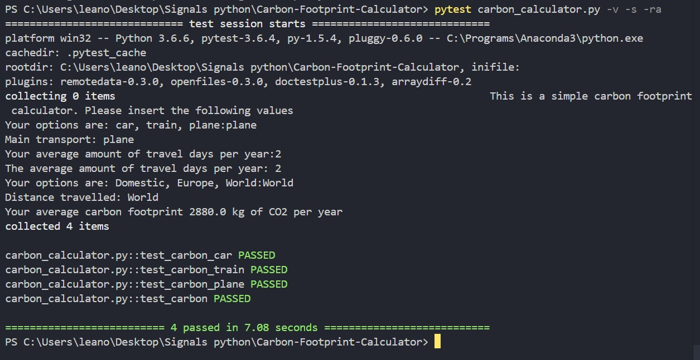
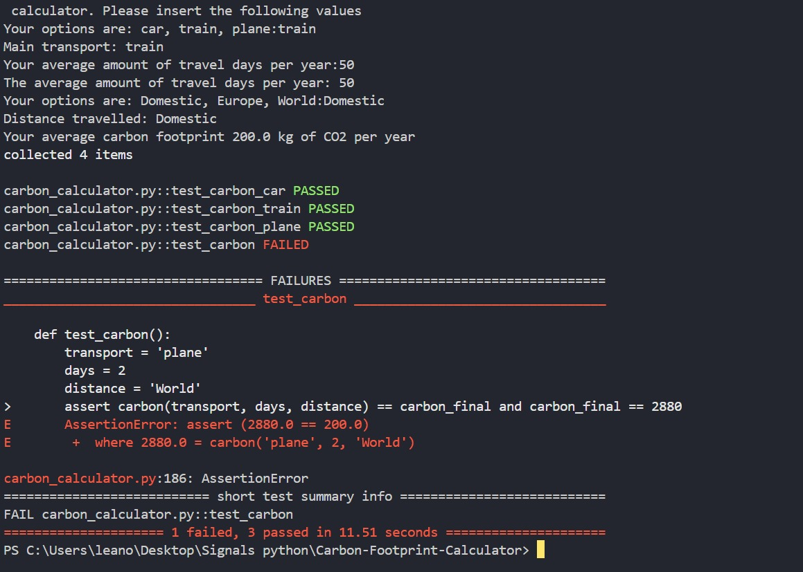

# Carbon-Footprint-Calculator
This simple carbon footprint calulator is an estimate of the users carbon footprint in a year based on their traveling frequency and destination. The user can only select one option.
Lea Stritzke (5785189)

# Here we define the main variables for the carbon footprint calculation
    Args:
        main_transport (str) #User chooses the main transport. The function only works if we type the specifically listed variables: car, train plane. Input: string, 

        travel_days (str) #User chooses the average amount of travel days, where the average has to be estimated by the user himself. 

        distance (str) #User chooses the most frequent traveling destination to approximate the carbon footprint. The function only works if we type the specifically listed variables: Domestic (within their country), Europe, World. 

# average values for each mean of transport (kg of carbon per km) reference: Our World in Data
    car_co2 (int)
    train_co2 (int)
    plane_co2 (int)

# average values for distances in km
    Domestic_distance (int)
    Europe_distance (int)
    World_distance (int)

# function carbon_car
    First the amount of days travelled by car is calculated => carbon_car_days
    Then the carbon usage is being calculated depending on the travel distance: Domestic, Europe, World
    by multiplying the given distance by car_co2.
    Returns carbon_transport(flt) which is the final average carbon usage per year.

# function carbon_train
    First the amount of days travelled by train is calculated => carbon_train_days
    Then the carbon usage is being calculated depending on the travel distance: Domestic, Europe, World by multiplying the given distance by train_co2.
    Returns carbon_transport(flt) which is the final average carbon usage per year.

# function carbon_plane
    First the amount of days travelled by plane is calculated => carbon_plane_days
    Then the carbon usage is being calculated depending on the travel distance: Domestic, Europe, World by multiplying the given distance by plane_co2.
    Returns carbon_transport(flt) which is the final average carbon usage per year.

# function carbon
    def carbon(main_transport, travel_days, distance):    
    Args:
        main_transport (str)
        travel_days (str)
        distance (str)
    
    int(travel_days) #converts string to an integer in order to proceed proper multiplication. 
    
    all if, elif, else statements make it possible that the calculator uses only one selected option
    This function uses other, previously determined functions: carbon_car, carbon_train, carbon_plane
    Returns: 
        carbon_transport (flt) is the product of the main variables multiplied by their assigned average carbon consumption and average distance.

# code explanation
    The code takes three user inputs main_transport, travel_days that only take values from 0 to 365 and distance. main_transport and distance are key sensitive. 
    If user uses incorrect strings for those two variables the user input is going to repeat itself in order to insert correct values.
    carbon_final reads the carbon function with the specific user inputs. Then it prints the result. 

# general improvements
    - add more means of transport and their corresponding CO2 usage
    - for the destination cases, make them more exact -  make a better approximation of the average CO2 consumption within every distance range (make the concumption dependant on the exact distance itself)
    - select different amount of travel days for each mean of transport
    - add more variables not only depending transport like: recycling, groceries, clothing, energy usage 
    - make the user select given main variables and not type 
    - estimate of the carbon neutralization price for the produced amount of carbon in order so the user can neutralize their carbon consumption

# pytests

In the picture above we can see that the pytests did run correctly and none of the functions did not fail. What is important to mention is that function carbon is a user input function. What follows with that is that is that the test_carbon will only work if after running the test we will insert verules: plane, 2, World. In any other case that test will fail unless we modify the test function each time.

Here we see an example of a failed pytest for function carbon. The pytest in the code has not been changed so it's failing because we entered: train, 50, Domestic. It was sure from the begnning that the test will fail.

# failure at packaging
After installing wheels and build and then running <python -m build> my package seemed to be working. Although it was working the name was UNKNOWN, which is not the name of my file. I believe the issue might be because of wrong versions of wheel or build on my machine. Even though i tried to uninstall and install again the name was still UNKNOWN. A different user downloaded the newest version of my package from GitHub and for them the package carbon_calculator seemed to work and they were able to use pip install for it. 
Isssue to be resolved.